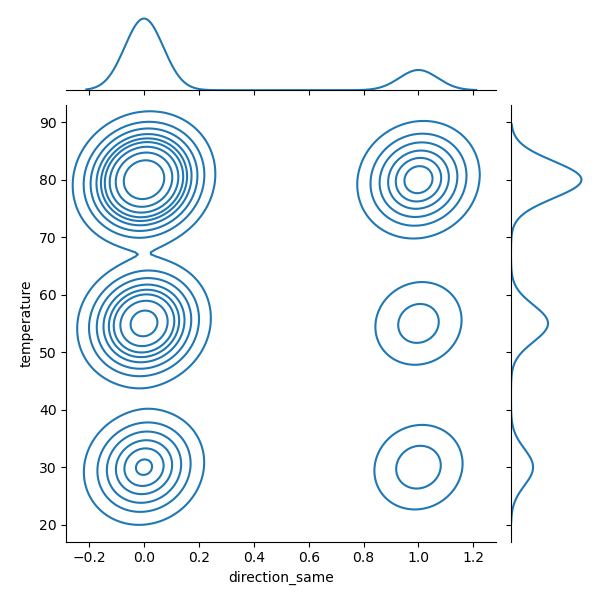

# Required Assignment 5.1: Will the Customer Accept the Coupon? 
## Data used in this research is from the UCI Machine Learning Repository and was collected via a survey on Amazon Mechanical Turk
Please use the following link to view my findings and supporting plots created using above mentioned data : <url>https://github.com/sganesan64/A5Coupon/blob/main/PracticalAssignment1.ipynb</url>
## Verified data when <u>customers accepted</u> coupons using Seaborns Joint plot correlation to the temperature and Direction
sns.jointplot(dfcpn.query("Y == 1"),x='direction_same',y='temperature',kind='kde')
    

## Findings 1: 
From the above plot it is obvious higher temperature has positive impact on the decision to accept the coupon.

At the same time, whether same direction or not, the plot suggest that Direction has no bearing on accepting the coupon.
